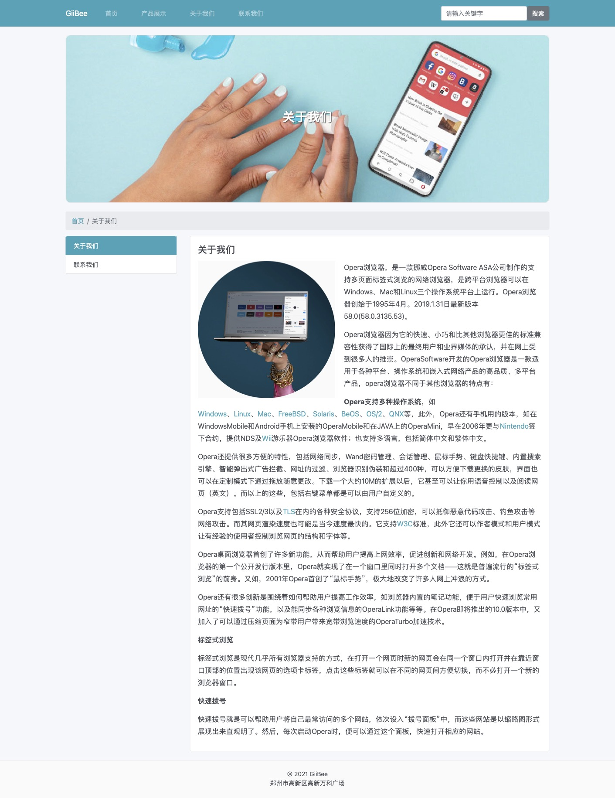
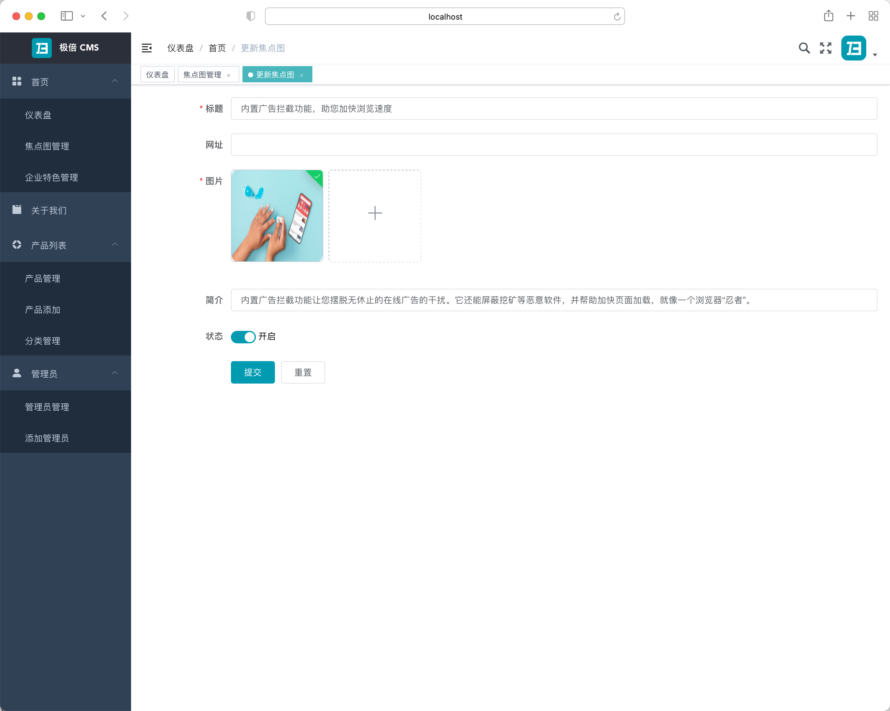
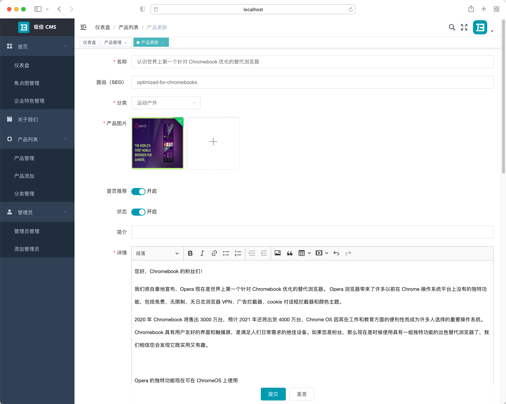
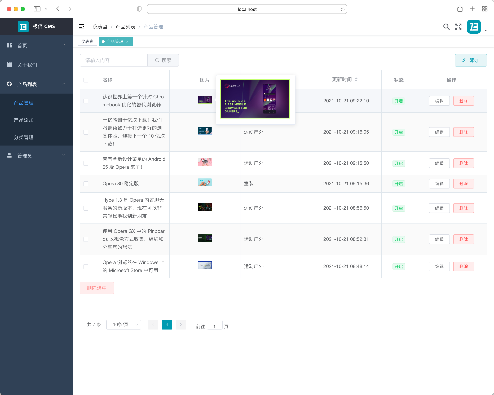
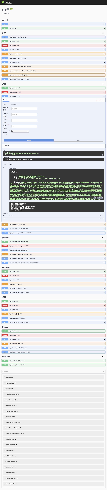

# GiiBee CMS

> 使用 nest.js 基于 node.js 和 nuxt.js 基于 vue.js 开发的 CMS 系统，实现 SSR 服务端渲染，且可生成静态HTML，有利于SEO。适合企业搭建SEO型网站。

[English](./README.md) | 简体中文]


## 开始使用

### MySql

1. 创建 `nest_cms_api` 表；

2. 使用 MySql 命令或者管理软件导入 `DB` 目录下的 `.sql` 文件。

### CMS API

```bash
cd server

npm install 

# 开发
$ npm run start

# 开发监听模式
$ npm run start:dev

# 生产模式
$ npm run start:prod
```

* 查看: [http://localhost:3000/](http://localhost:3000/)
* API 文档: [http://localhost:3000/api/](http://localhost:3000/api/)

### CMS 管理系统

```bash
cd admin

npm install 

# 开发模式
npm run dev

# 构建

npm run build:stage

npm run build:prod
```

* 查看: [http://localhost:3002/](http://localhost:3002/)


### CMS web

```bash
cd web

npm install 

# 开发模式
$ npm run dev

# 构建生产环境并启动服务
$ npm run build
$ npm run start

# 生成静态项目
$ npm run generate
```

* 查看： [http://localhost:3001/](http://localhost:3001/)


## 特色

* NestJS + MySql 输出 API。
* API 调用敏感操作记录 IP、管理员及客户端信息。
* Nuxtjs 实现 Vue  SSR 服务端渲染 (SEO)。
* NuxtJS + Vue + Bootstrap-vue 实现整站生成 HTML 静态网站 (SEO)。
* Element UI + Vue 实现 CMS 系统管理。
* 前后端分离开发。
* JWT 身份认证。
* 商品分类支持自定义路由和网页描述 (SEO)。
* 产品名称支持自定义路由和网页描述 (SEO)。
* 响应式网页，适配 PC 端和移动端。

## 截图

### CMS web
    

    

    

    

    
    

### CMS 管理

    

    

    

### CMS  API

    

## License

[Apache License 2.0](LICENSE).
